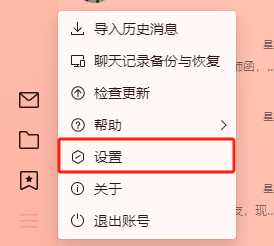
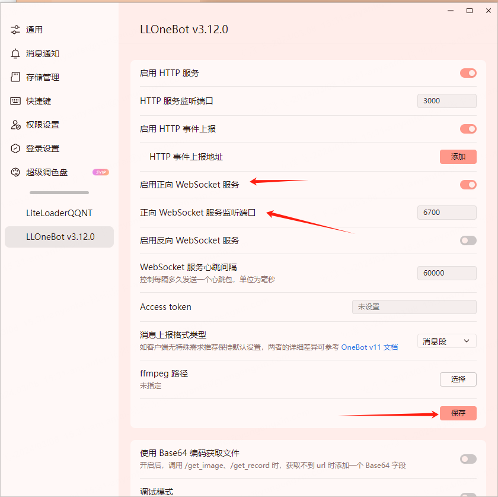

# go-LiteLoaderQQNT
针对 [LiteLoaderQQNT](https://liteloaderqqnt.github.io) 的安装脚本

## 首先感谢

https://github.com/Mzdyl/LiteLoaderQQNT_Install
和
https://github.com/LLOneBot/LLOneBot]

两家大佬的作品，才能让我们golang小股力量发亮发光。

还要感谢咱们的[ZeroBot-Plugin](https://github.com/FloatTech/ZeroBot-Plugin) 椛椛 让我们的社区慢慢的变得大大起来。

开发交流群：1048452984

## 安装方法
只测试了Windows的，linux和mac的最新sh脚本请移步https://github.com/Mzdyl/LiteLoaderQQNT_Install

现在开始：

1、在release中下载好了liteLoadQQNT.exe 

2、非常重要的：完全关闭QQ，不要留进程

3、Windows右击使用管理员运行 exe  即可

4、完成后按回车就可以完成进程，就可以打开QQ，找到设置

然后找到LLOneBot了

记得要保存自己的设置哟~

### 测试版

Win 用户可以通过 [Github Releases](https://github.com/anyanfei/go-liteLoadQQNT/releases) 下载最新测试版本

## 版本支持

理论支持 QQNT 桌面端 全架构 全版本

## 升级更新

若 LiteLoaderQQNT 更新版本一样可以使用 脚本/exe 升级

## 常见问题

**Windows 用户请确保使用 已管理员身份运行。**

特别鸣谢：

[LiteLoaderQQNT](https://github.com/LiteLoaderQQNT/LiteLoaderQQNT)

windows脚本借用[QQNTFileVerifyPatch](https://github.com/LiteLoaderQQNT/QQNTFileVerifyPatch)项目代码实现修补

附加安装的[插件商店](https://github.com/Night-stars-1/LiteLoaderQQNT-Plugin-Plugin-Store/releases)
